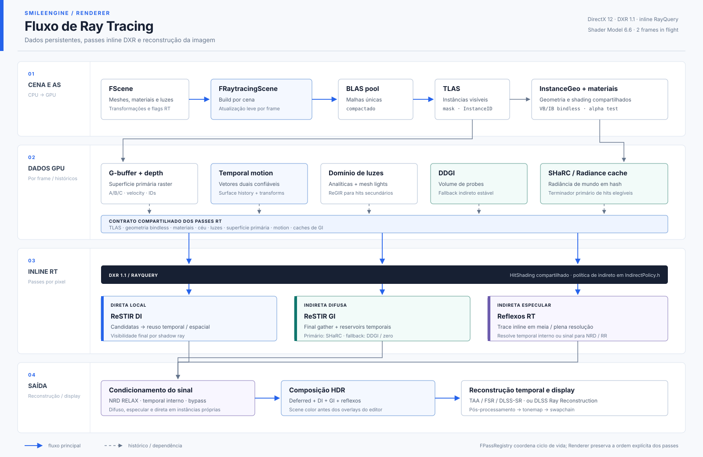

# SmileEngine

<p align="center">
  Uma engine de renderização experimental em DirectX 12, com editor próprio,
  ray tracing em tempo real e pipeline offline de assets.
</p>

<p align="center">
  
  
  
  
  
</p>

> [!NOTE]
> Projeto pessoal voltado a estudo e experimentação com técnicas modernas de
> renderização. No momento, a engine suporta apenas Windows x64.

## Visão geral

A SmileEngine combina **deferred shading** com **DXR 1.1 inline
(RayQuery)**. O projeto inclui uma biblioteca de renderização em C++,
um editor visual em Qt/QML, shaders HLSL compilados com DXC e ferramentas para
processar e automatizar o fluxo de assets.

### Principais recursos

- RHI sobre DirectX 12, com gerenciamento de descriptors e recursos de GPU;
- editor com viewport nativo, outliner, gizmos e edição de materiais;
- iluminação global com DDGI e ReSTIR GI/DI;
- reflexos por ray tracing e denoise opcional com NRD;
- atmosfera, nuvens volumétricas, fog, chuva e ciclo de horário;
- sombras CSM e sombras locais para luzes spot e point;
- oceano FFT, terreno CDLOD, bloom, ACES e TAA;
- suporte opcional a AMD FSR 3.1 e NVIDIA DLSS;
- captura determinística de frames para comparação visual;
- cooker de FBX para os formatos `.smesh` e `.sscene`;
- servidor MCP para automação local de build, execução e profiling.

## Screenshots

> Capturas do editor e das cenas de referência serão adicionadas aqui.

<!--
Sugestão de arquivos em Docs/Screenshots/:

| Viewport | Editor de materiais |
|:--:|:--:|
|  |  |

| Configurações de render | Time of Day |
|:--:|:--:|
|  |  |
-->

## Requisitos

- Windows 10 ou 11 x64;
- Visual Studio 2022 com toolchain MSVC;
- CMake 3.25 ou mais recente;
- Windows SDK `10.0.22621.0` com `dxc.exe`;
- Qt `6.10` para MSVC 2022 x64;
- GPU e driver com suporte a DirectX 12.

Para usar os passes correspondentes, também podem ser configurados os SDKs
opcionais:

| Integração | Variável CMake |
|---|---|
| AMD FidelityFX / FSR 3.1 | `SMILE_FSR_ROOT` |
| NVIDIA Streamline / DLSS | `SMILE_SL_ROOT` |
| NVIDIA Real-time Denoisers | `SMILE_NRD_ROOT` |
| NVIDIA NVAPI | `SMILE_NVAPI_ROOT` |

Na ausência desses SDKs, as integrações são compiladas como stubs e o restante
da engine continua disponível.

## Compilação

No PowerShell, a partir da raiz do projeto:

```powershell
cmake -B build -G "Visual Studio 17 2022" -A x64 `
  -DCMAKE_PREFIX_PATH="C:/Qt/6.10.2/msvc2022_64"

cmake --build build --config Debug --target Shaders SmileEditor SmileCooker
```

Os binários são gerados em `build/bin/Debug/`. O pós-build do editor executa o
`windeployqt` e copia os recursos necessários para o mesmo diretório.

### Executar o editor

```powershell
.\build\bin\Debug\SmileEditor.exe
```

Também é possível abrir uma cena durante a inicialização:

```powershell
.\build\bin\Debug\SmileEditor.exe C:\caminho\para\cena.sscene
```

### Processar um FBX

```powershell
.\build\bin\Debug\SmileCooker.exe C:\caminho\para\modelo.fbx
```

O cooker gera os arquivos `.smesh` e `.sscene` ao lado do FBX. Um segundo
argumento opcional define o caminho de saída sem extensão.

## Testes

Os testes registrados no CTest cobrem matemática do oceano, ciclo lunar e
identidade de cenas:

```powershell
ctest --test-dir build -C Debug --output-on-failure
```

## Estrutura do projeto

```text
SmileEngine/
├── Engine/          # Biblioteca C++ e subsistemas de renderização
├── Editor/          # Aplicação SmileEditor em Qt/QML
├── Shaders/         # Shaders HLSL organizados por subsistema
├── Tools/
│   ├── Cooker/      # Conversão de FBX para os formatos da engine
│   ├── AllocBench/  # Benchmark de alocação D3D12MA
│   └── SmileMCP/    # Automação local via Model Context Protocol
├── Tests/           # Testes registrados no CTest
├── Assets/          # Texturas e recursos versionados
├── Docs/            # Arquitetura, protocolos e auditorias técnicas
└── cmake/           # Utilitários do sistema de build
```

## Arquitetura

O editor hospeda o viewport e os painéis Qt/QML, enquanto uma render thread
controla o renderer e seus subsistemas DX12.

<p align="center">
  
</p>

Para detalhes sobre o frame graph, RHI, shaders e subsistemas, consulte a
[documentação de arquitetura](Docs/ARCHITECTURE.md).

## Documentação

- [Arquitetura da engine](Docs/ARCHITECTURE.md)
- [Protocolo de captura determinística](Docs/CAPTURE-PROTOCOL.md)
- [Movimentos e dados temporais](Docs/TEMPORAL_MOTION_VECTORS.md)
- [SmileMCP](Tools/SmileMCP/README.md)

## Status

A SmileEngine está em desenvolvimento ativo. APIs, formatos de cena e
integrações podem mudar enquanto os subsistemas são expandidos.
